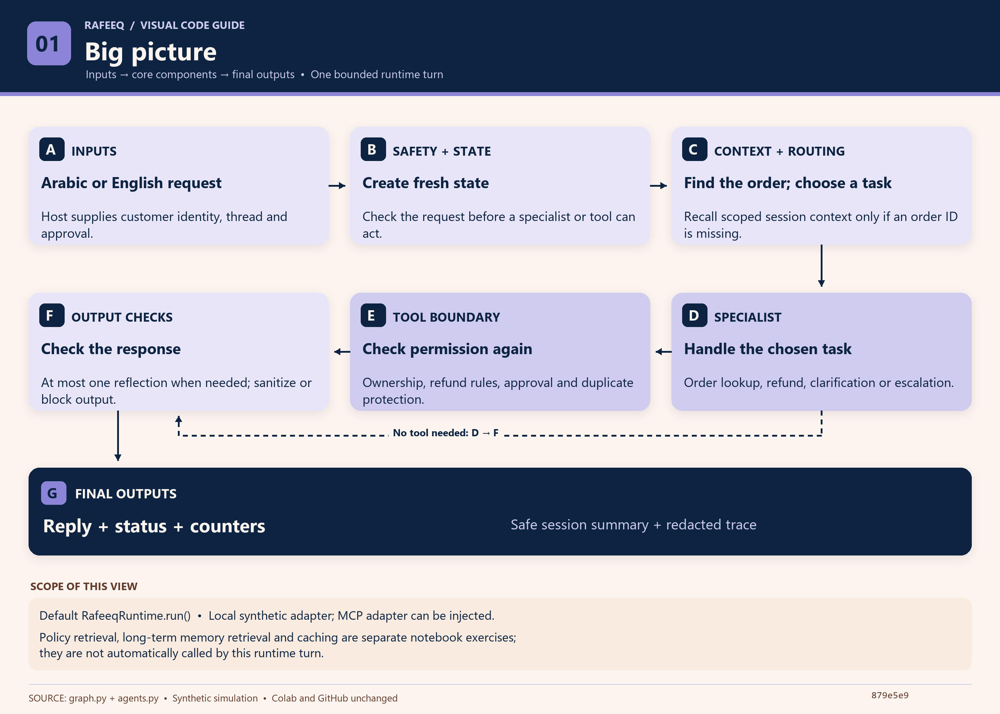
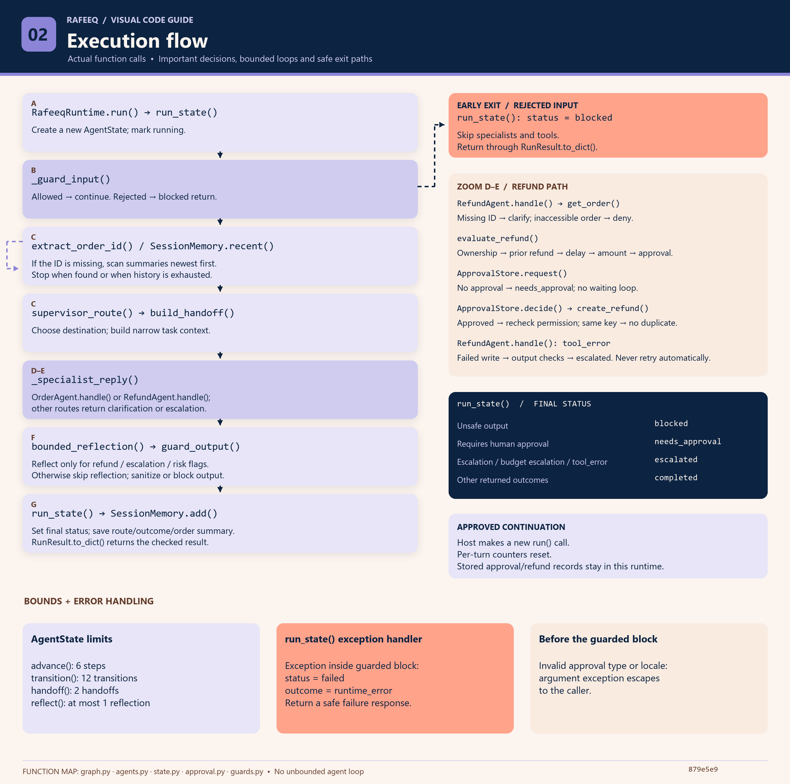
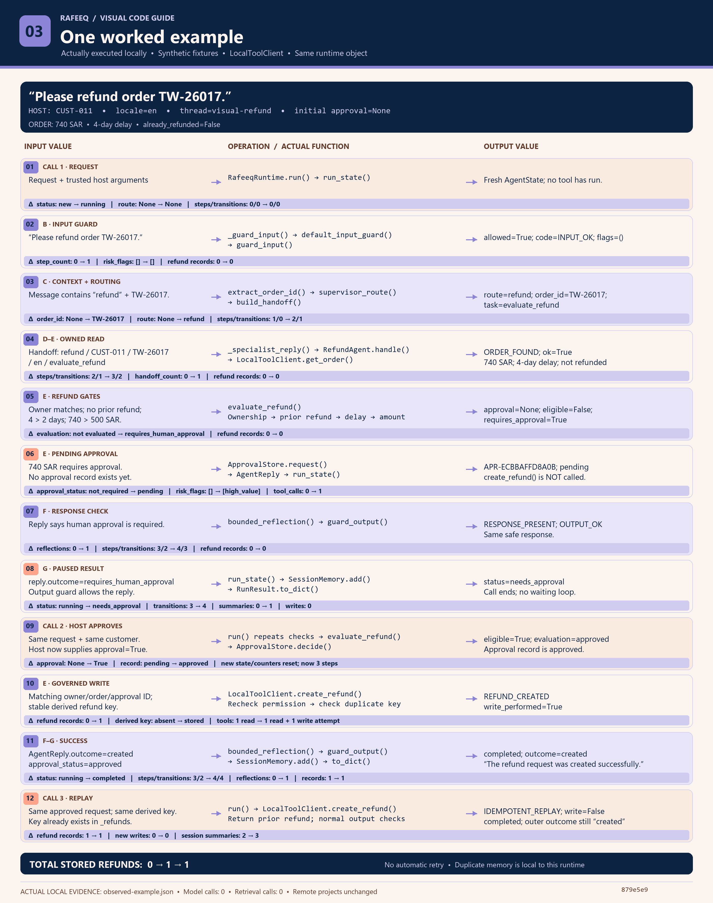

# See Rafeeq in Action

**Three pictures. One request. Follow the code from start to finish.**

Explore the [big picture](#1--big-picture), follow the [execution flow](#2--execution-flow), then watch a [740 SAR refund example](#3--one-worked-example). Click any picture to open it at full size.

## 1 · Big picture

- **A · Inputs:** The customer sends a request. The host provides their identity, conversation ID and approval information.
- **B · Safety + state:** Create a fresh record for this run and check whether the request is allowed.
- **C · Context + routing:** Find the order ID and choose the task. Check recent conversation summaries if the ID is missing.
- **D · Specialist:** Handle order lookup, refund, clarification or escalation.
- **E · Tool boundary:** Check ownership, refund eligibility, approval and duplicate protection before accessing or changing data. Skip this stage when no tool is needed.
- **F · Output checks:** Check the reply, perform a limited reflection when required, and sanitize or block unsafe output.
- **G · Final outputs:** Return the reply, status and counters. Save a safe conversation summary and redacted trace.

**Scope:** This view follows the default `RafeeqRuntime.run()` path. Policy retrieval, long-term memory retrieval and caching are separate notebook exercises; this runtime path does not call them automatically.

## 2 · Execution flow

1. **`run() → run_state()`:** Start a new run with fresh state and counters.
2. **`_guard_input()`:** Check the incoming request. If rejected, return `blocked` immediately.
3. **`extract_order_id() / SessionMemory.recent()`:** Find the order ID in the request. If missing, scan recent summaries until found or history runs out.
4. **`supervisor_route() → build_handoff()`:** Choose the destination and prepare the information the specialist needs.
5. **`_specialist_reply()`:** Ask the appropriate specialist to handle the task.
6. **`bounded_reflection() → guard_output()`:** For higher-impact cases, check the response once; then sanitize or block unsafe output.
7. **`SessionMemory.add() → to_dict()`:** Save the operational summary and return the final result.

### Refund zoom-in

- **Read the order:** Missing information leads to clarification; an inaccessible order is denied.
- **Evaluate eligibility:** Check ownership, previous refunds, delivery delay, amount and approval.
- **Request approval:** If required approval is missing, return `needs_approval`. The run ends.
- **Apply approval:** The host starts another run with approval. The tool checks permission again and prevents duplicate refunds.
- **Handle failure:** A failed refund write leads to escalation; the system does not retry automatically.

### Limits and exits

- **Limits:** Each run allows up to 6 steps, 12 transitions, 2 handoffs and 1 reflection.
- **Final status:** The result can be `blocked`, `needs_approval`, `escalated` or `completed`.
- **Errors:** Exceptions inside the guarded block return `failed`. Invalid approval types or locales raise an error directly to the caller.

## 3 · One worked example

*This example was executed locally using synthetic data and `LocalToolClient`. All three calls use the same runtime object.*

1. **Start:** The customer asks to refund order `TW-26017`. Create a fresh run.
2. **Check input:** The request passes the safety check.
3. **Choose the task:** Extract `TW-26017` and route the request to the refund specialist.
4. **Read the order:** Confirm ownership and find a **740 SAR** order delayed by **4 days**, with no previous refund.
5. **Check refund rules:** The delay qualifies, but the amount exceeds **500 SAR**, so human approval is required.
6. **Request approval:** Create a pending approval record. **No refund is created.**
7. **Check the reply:** Verify that the response safely explains the approval requirement.
8. **End the first run:** Return `needs_approval` and save a summary. The system does not keep waiting.
9. **Approve:** The host sends the request again with `approval=True`. A new run repeats the checks and records approval.
10. **Create the refund:** Recheck permission and the duplicate key. Refund records change from **0 → 1**.
11. **Return success:** Check the success reply, save a summary, and return `completed`.
12. **Repeat safely:** Send the approved request again. The tool recognizes the existing refund and returns it without creating another. Refund records remain **1 → 1**.

| Call | Host approval | Result | New refunds |
|---|---|---|---|
| First request | `None` | `needs_approval` | 0 |
| Approved request | `True` | `completed` / `REFUND_CREATED` | 1 |
| Same request again | `True` | `completed` / `IDEMPOTENT_REPLAY` | 0 |

The replay's outer outcome still says `created`, but the tool reports `write_performed=False`. Duplicate protection here is local to this runtime; it is not durable production storage.

## Code behind the pictures

- [Runtime and routing](../../src/rafeeq/graph.py)
- [Specialists, refund policy and local tools](../../src/rafeeq/agents.py)
- [State and limits](../../src/rafeeq/state.py)
- [Approval records](../../src/rafeeq/approval.py)
- [Input and output guards](../../src/rafeeq/guards.py)

The diagrams describe code at commit `879e5e9`. Their local evidence filename and remote-freeze notes refer to when the pictures were created. Publishing this guide updates documentation only; it does not rerun Colab or change the agent implementation. The submission manifest and receipt are refreshed for this documentation packaging update; the original assessment run and notebook evidence are preserved.

[← Back to the project](../../README.md)
